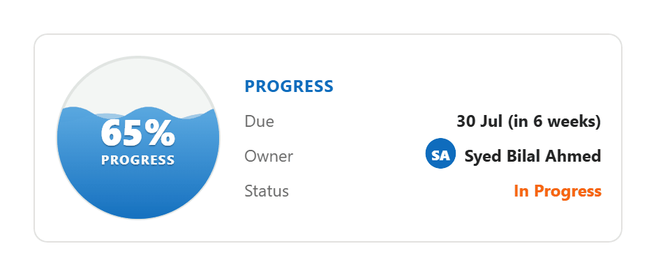
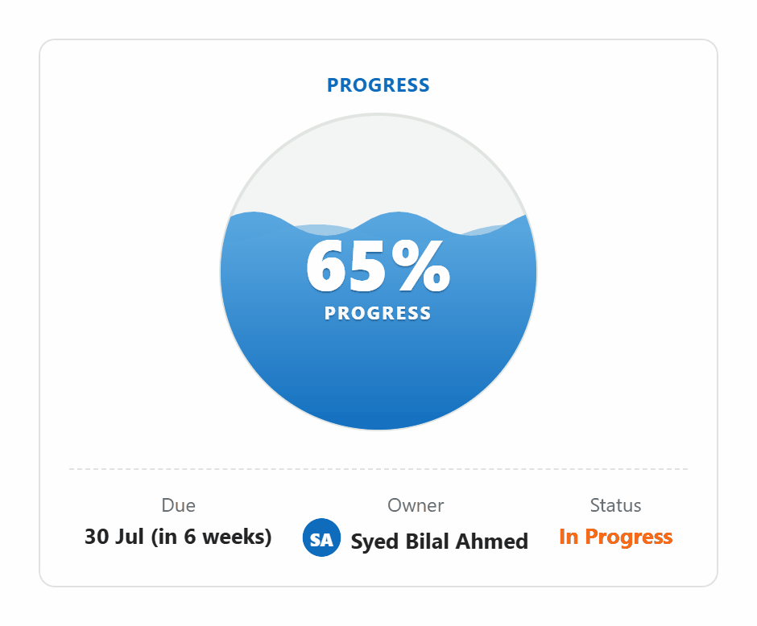

# LiquidProgress

> An animated liquid-filled sphere PCF control for model-driven Power Apps. Bind any Decimal column where `0` = 0% and `1` = 100%, and your form gets a living visual instead of a plain number.

[](https://github.com/syedbilal1997/LiquidProgress-PCF/releases)
[](LICENSE)
[](https://learn.microsoft.com/power-apps/developer/component-framework)

Perfect for **execution %, progress %, capacity, utilisation, attendance, satisfaction scores** — any 0-to-1 proportional metric on a Dataverse table.

- 🪄 **Drop-and-go.** Bind one Decimal column. That's the only required step.
- 📐 **Three sizes, one control.** `Auto` · `Compact` · `Medium` · `Hero`.
- 🎨 **Auto Dataverse colours.** Bind a Choice/Choices column to the Status property — the option's own colour is used automatically.
- 👤 **Smart context.** Optional Due date (rendered as *"30 Sep (in 6 weeks)"*), Owner avatar from any lookup, brand-able accent.
- ⚡ **Tiny.** Dependency-free pure SVG + CSS. ~9 KB managed solution zip.

---

## See it in action

### 🎥 Live demo (Medium mode)

A real recording of the control running on a model-driven form — sphere filling, status colour pulled from a Dataverse Choice column, due date rendered, owner avatar, the lot.

<video src="https://github.com/syedbilal1997/LiquidProgress-PCF/raw/main/docs/screenshots/demo-medium.mp4" controls muted playsinline width="640" style="max-width:100%"></video>

> Can't see the player above? [Download or open the MP4 directly](docs/screenshots/demo-medium.mp4).

---

### Compact mode
Drop it on a normal field row in place of a boring percentage.


### Medium mode
Half-section card with a meta strip (Due / Owner / Status).



### Hero mode
Full-width showcase for when the % is the story.



---

## Quick install (3 minutes)

1. Download the latest `LiquidProgress_X.Y.Z_managed.zip` from the **[Releases](../../releases/latest)** page.
2. In Power Apps maker portal → **Solutions → Import** → upload the zip → publish.
3. Open any model-driven form, edit the form, pick a **Decimal column**, choose **Components → Get more components → LiquidProgress → Add**.

That's it. The sphere starts filling the moment you save and refresh the form.

> 💡 The `value` field expects a Decimal between **0 and 1** (e.g. `0.5` → 50%). If your data is stored as `0..100`, just normalise it on the form column.

---

## Properties

| Property | Type | Required | What it does |
|---|---|---|---|
| **Value (0..1)** | Decimal *(bound)* | ✅ | The thing being visualised. |
| **Display size** | Enum | — | `Auto` / `Compact` / `Medium` / `Hero`. Default: Medium. |
| **Label** | Text | — | Optional caption (e.g. `EXECUTION`). |
| **Accent colour (hex)** | Text | — | Override the default green (e.g. `#0f6cbd`). |
| **Due date** | Date column *(bound)* | — | Renders smart text like *"30 Sep (in 6 weeks)"* / *"5 days overdue"*. |
| **Owner** | Lookup column *(bound)* | — | Shows the lookup's display name with an initials avatar. |
| **Status** | Choice or Choices column *(bound)* | — | Uses the option's Dataverse-defined colour automatically. |
| **Status text (fallback)** | Text | — | Plain status text — used only if Status (choice) isn't bound. |

## Display sizes — how to pick

- **Auto** lets the control choose based on the section width (compact when < 200px, medium when < 360px, hero when ≥ 360px). Great when you don't want to think about it.
- **Compact** is the safest "drop on a normal field" choice.
- **Medium** gives you the meta strip in a 2-column section.
- **Hero** is the showpiece — drop it in a full-width single-column section.

---

## Building from source

The project follows the *controlsRoot* PCF layout (pcfproj at the outer level, control source in an inner folder of the same name).

```powershell
# One-off install
npm install

# Iterate in the test harness — opens a browser tab
npm start watch

# Produce a versioned managed-solution release zip
.\scripts\build-release.ps1 -Version "1.4.0"
# → release/LiquidProgress_1.4.0_managed.zip
```

The release script invokes `dotnet build --configuration Release` on the solution wrapper under `Solution/` and copies the resulting zip into `release/` with a clean filename.

## Repo layout

```
LiquidProgress/                       ← repo root
├── LiquidProgress.pcfproj            ← MSBuild project
├── pcfconfig.json                    ← controlsRoot: ./LiquidProgress
├── package.json, tsconfig, eslint
├── LiquidProgress/                   ← control source
│   ├── ControlManifest.Input.xml
│   ├── index.ts
│   ├── css/LiquidProgress.css
│   └── strings/LiquidProgress.1033.resx
├── Solution/                         ← Dataverse solution wrapper
├── scripts/build-release.ps1         ← one-click versioned build
├── release/                          ← built zips (gitignored)
└── docs/screenshots/                 ← README assets
```

---

## Contributing

Issues, ideas, and PRs are welcome. See [`CONTRIBUTING.md`](CONTRIBUTING.md) for the build setup and contribution flow.

If you build something cool with this — a creative use case, a slick form, an unusual colour scheme — I'd genuinely love to see it. Open an issue with a screenshot, or tag me on LinkedIn.

## Author

**Syed Bilal Ahmed** — Microsoft Dynamics 365 / Power Platform developer based in Dubai.
I write about PCF and Power Platform development at [syedbilal365.hashnode.dev](https://syedbilal365.hashnode.dev).

- 🌐 Blog — [Bilal on Power Platform](https://syedbilal365.hashnode.dev)
- 💼 LinkedIn — [linkedin.com/in/sybilal](https://www.linkedin.com/in/sybilal/)
- 🐙 GitHub — [@syedbilal1997](https://github.com/syedbilal1997)

If LiquidProgress saves you an afternoon, ⭐ the repo — it's the easiest way to say thanks and helps other Power Platform devs discover it.

## License

[MIT](LICENSE) © 2026 Syed Bilal Ahmed
