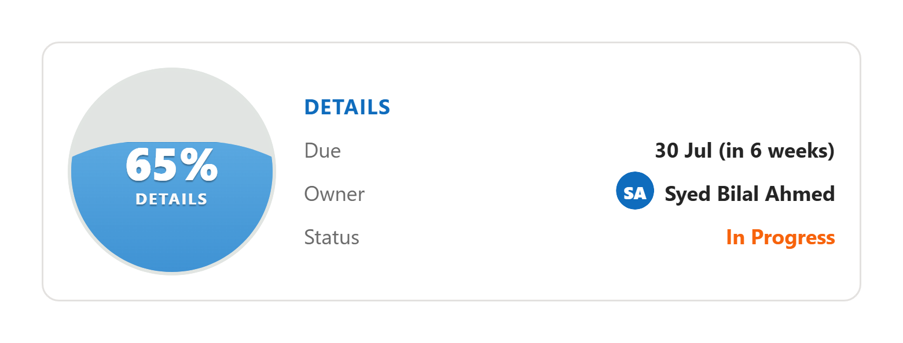
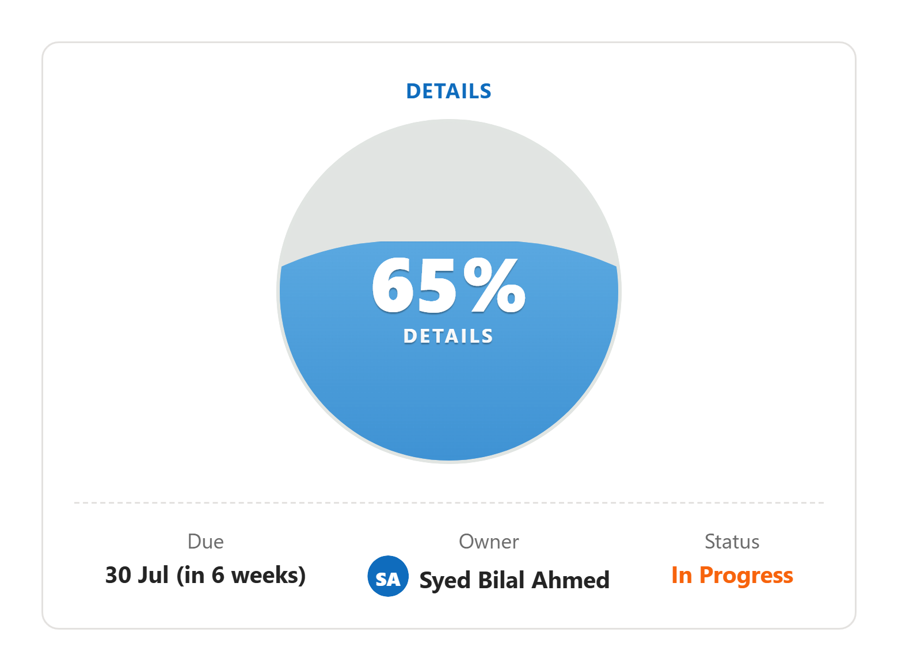

# LiquidProgress

An animated liquid-filled sphere PCF control for model-driven Power Apps.

Bind it to any Decimal column (`0` → empty, `1` → full, `0.5` → half) and watch the sphere fill up. Perfect for execution %, progress %, capacity, utilisation, satisfaction scores — any 0-to-1 proportional metric.

- **Drop-and-go.** Bind one decimal field. That's the only required step.
- **Three sizes, one control.** Compact, Medium, Hero — or `Auto` to pick from available width.
- **Picks up Dataverse colours.** Bind a Choice/Choices column to the Status property and the option's own colour is used automatically.
- **Dependency-free.** Pure SVG + CSS. ~9 KB managed solution.

---

## See it in action

### Compact mode
Tiny inline sphere — replaces a regular % field in any row.


### Medium mode
Half-section card with a meta strip (Due / Owner / Status).



### Hero mode
Full-width section showcase with the meta strip below.



---

## Install

1. Grab the latest `LiquidProgress_X.Y.Z_managed.zip` from the [Releases](../../releases) page.
2. In Power Apps maker portal: **Solutions → Import** → upload the zip → publish.
3. Open any model-driven form, edit the form, pick a **Decimal column**, choose **Components → Get more components → LiquidProgress → Add**.

That's it. The control will render with default settings the moment you save the form.

## Properties

| Property | Type | Required | What it does |
|---|---|---|---|
| **Value (0..1)** | Decimal (bound) | Yes | The thing being visualised. |
| **Display size** | Enum | No | `Auto` / `Compact` / `Medium` / `Hero`. Defaults to Medium. |
| **Label** | Text | No | Optional caption (e.g. "EXECUTION"). |
| **Accent colour (hex)** | Text | No | Override the default green (e.g. `#0f6cbd`). |
| **Due date** | Date column (bound) | No | Renders smart text like *"30 Sep (in 6 weeks)"*. |
| **Owner** | Lookup column (bound) | No | Shows the user's name with an initials avatar. |
| **Status** | Choice or Choices column (bound) | No | Uses the option's Dataverse-defined colour automatically. |
| **Status text (fallback)** | Text | No | Plain status text — used only if Status (choice) is not bound. |

## Display sizes — how to pick

- **Auto** lets the control choose based on the section width (compact < 200px, medium < 360px, hero ≥ 360px). Great when you don't want to think about it.
- **Compact** is the safest "drop on a normal field" choice.
- **Medium** gives you the meta strip in a 2-column section.
- **Hero** is the showpiece — drop it in a full-width single-column section.

## Building from source

The project follows the *controlsRoot* PCF layout (pcfproj at the outer level, control source in a subfolder).

```powershell
# One-off install
npm install

# Iterate in the test harness
npm start watch

# Produce a versioned managed-solution release zip
.\scripts\build-release.ps1 -Version "1.4.0"
# → release/LiquidProgress_1.4.0_managed.zip
```

The release script invokes `dotnet build --configuration Release` on the solution wrapper under `Solution/` and copies the resulting zip into `release/` with a clean filename.

## Repo layout

```
LiquidProgress/                       <- repo root
├── LiquidProgress.pcfproj            <- MSBuild project
├── pcfconfig.json                    <- controlsRoot: ./LiquidProgress
├── package.json, tsconfig, eslint
├── LiquidProgress/                   <- control source
│   ├── ControlManifest.Input.xml
│   ├── index.ts
│   ├── css/LiquidProgress.css
│   └── strings/LiquidProgress.1033.resx
├── Solution/                         <- Dataverse solution wrapper
├── scripts/build-release.ps1         <- one-click versioned build
├── release/                          <- built zips (gitignored)
└── docs/screenshots/                 <- README assets
```

## License

Private control — not licensed for redistribution. Contact the author for usage terms.
